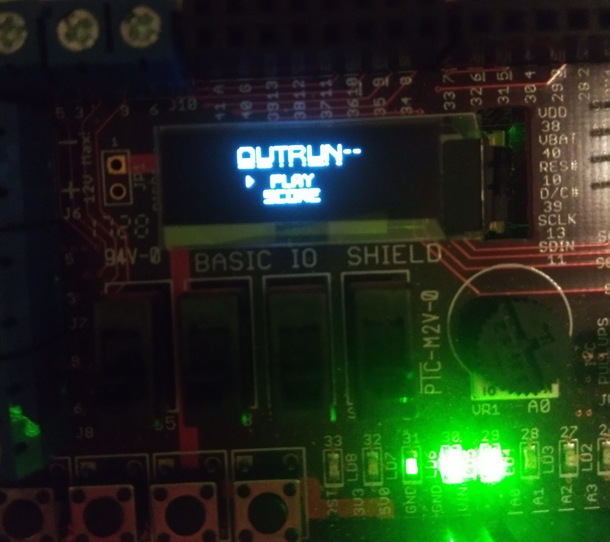

# An IS1500 Project: **OutRun--**
### By Azeez D. & Herdi S.

# Description
This is the final project of the "IS1500 Computer Organization and Components" course in KTH Royal Institue of Technology. The project is to create a non-trivial program that runs on an embedded platform, which in this case is a ChipKIT Uno32 with a ChipKIT Basic I/O shield.

# Approach
We decided to make a game inspired by the SEGA game OutRun. It is an arcade car driving game with an objective to drive as much as possible without crashing. Our objective was to capture the main essences of the game which are the player car and the other non-player cars on the road. The road twists and turns randomly and the more the player travels the more points they gain which is displayed on the scoreboard alongside a three-letter name which is typed in following a crash. Additionally we added extra fun features such as speedometer with the leds, a turbo mode, and a side scenary with lamps, buildings and trees as well as turning animations for the non-player cars, splash screen upon chip startup, and a crash animation.

# Images

## Menu

## Gameplay

## Death Screen & Initials Typing

## High Score Screen

